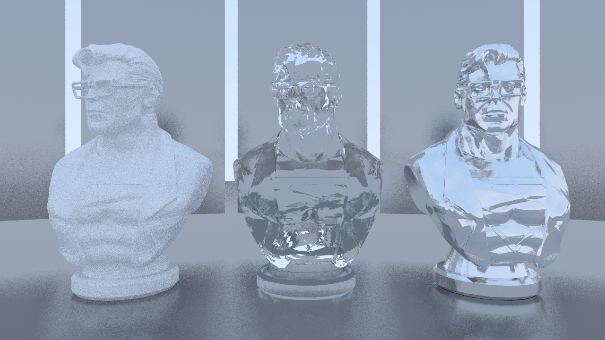
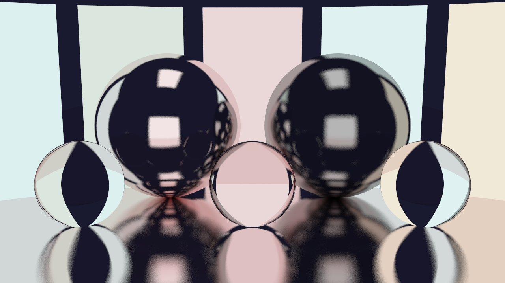

# Basic Raytracer
## Scene Description File
The raytracer supports loading assets and generating primitive 3D objects based on a scene description
text file
```
# Scene description for Scene 1
NAME "Scene01"

# Render parameters
# Mostly self explanatory
# MAX_RDEPTH is the max recursion depth
IMG_WIDTH   1400
IMG_HEIGHT  720
NUM_SAMPLES 50
NUM_THREADS 12
MAX_RDEPTH  50

# General scene parameters

# Materials
# LAMBERTIAN : LAMBERTIAN [albedo_r] [albedo_g] [albedo_b]
# METAL      : METAL [albedo_r] [albedo_g] [albedo_b] [fuzziness ]
# DIELECTRIC : DIELECTRIC [rel_ior]
# TEXTURED   : TEXTURED [is_emissive] [albedo_path] [normal_path] [roughness_path] [ambient_occlusion_path] 
# EMISSIVE   : EMISSIVE [color_r] [color_g] [color_b]
# Example: LAMBERTIAN  0.5 0.5 0.5

# Primitive format
# Sphere:       p SPHERE [x] [y] [z] [radius] [mat_index]
# Triangle:     p TRI    [x1] [y1] [z1] [x2] [y2] [z2] [x3] [y3] [z3] [mat_index]
# -------------------------------------------------------------------------------------
# Example: p_SPHERE 0.0 0.5 -1.5  30.0 3

# .OBJ models
#OBJ       0 1.5 0.0  0.0 "../RTAssets/models/model.obj"

#         [x]  [y] [z]
CAM_POS  -0.7 -1.0 5.0
CAM_LOOK 0.05 -0.3 0.0
```
## Demo Images
<table>
    <tr>
        <td>
            <p><i>HDR background and Image-based lighting</i></p>
            
        </td>
    </tr>
    <tr>
        <table>
            <tr>
                <td>
                    <p><i>3D model with diffuse, metallic and refractive materials</i></p>
                    
                </td>
                <td>
                    <p><i>Light emission, reflection and refraction</i></p>
                    
                </td>
            </tr>
        </table>
    </tr>
    <tr>
        <small>Assets sources: </small>
        <small><a href="https://www.cgtrader.com/free-3d-print-models/miniatures/figurines/superman-3d-printable-bust">3D model source</a></small>
        <span><small>&#8226;</small></span>
        <small><a href="https://ambientcg.com/view?id=IndoorHDRI001">HDR background</a></small>
    </tr>
</table>